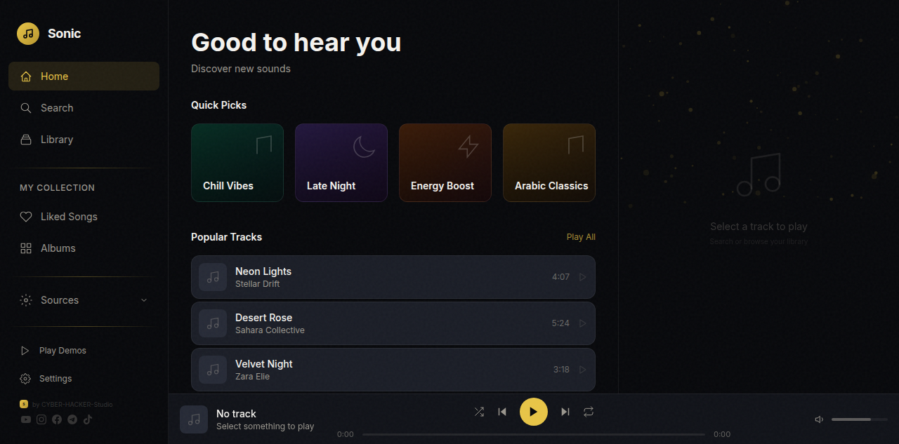
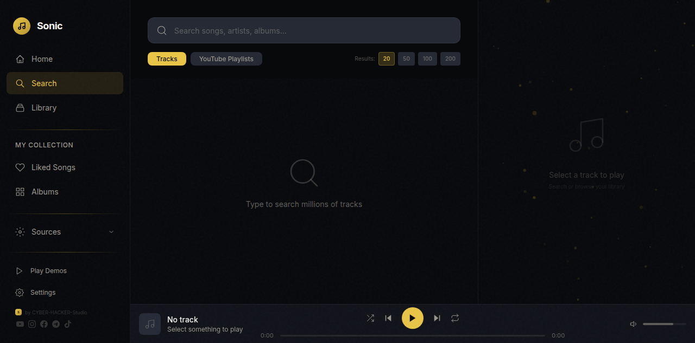
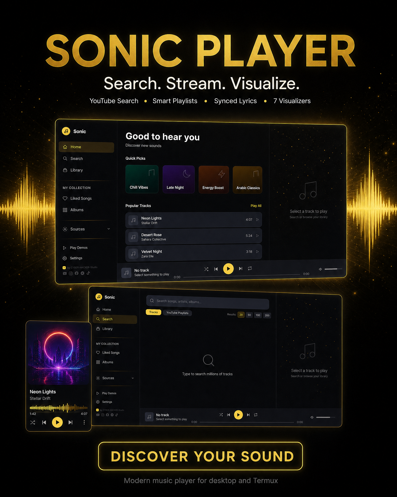
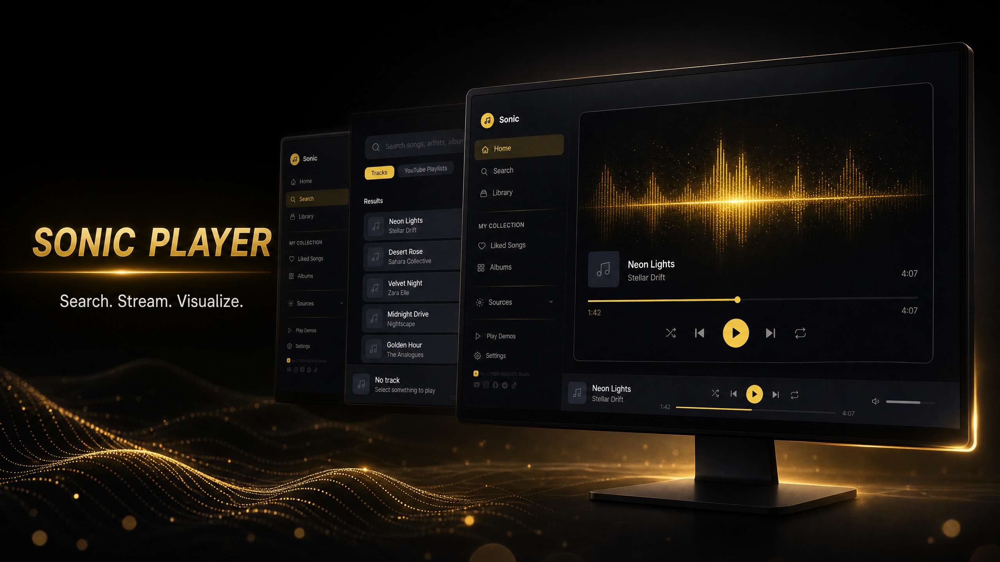

<div align="center">
  <br>
  <h1>🎵 SONIC PLAYER</h1>
  <p><b>Modern Music Streaming Application</b></p>
  <p>Search · Stream · Download · Visualize</p>
  <br>

  <!-- Badges -->
  
  
  
  
  <br><br>
  <!-- Social Links — SVG Icons -->
  <br>
  <a href="https://www.youtube.com/@nexora-studio-tm" target="_blank">
    <svg width="32" height="32" viewBox="0 0 24 24" fill="#808080" style="margin:0 6px;transition:fill 0.2s" onmouseover="this.fill='#ff0000'" onmouseout="this.fill='#808080'"><path d="M23.498 6.186a3.016 3.016 0 0 0-2.122-2.136C19.505 3.545 12 3.545 12 3.545s-7.505 0-9.377.505A3.017 3.017 0 0 0 .502 6.186C0 8.07 0 12 0 12s0 3.93.502 5.814a3.016 3.016 0 0 0 2.122 2.136c1.871.505 9.376.505 9.376.505s7.505 0 9.377-.505a3.015 3.015 0 0 0 2.122-2.136C24 15.93 24 12 24 12s0-3.93-.502-5.814zM9.545 15.568V8.432L15.818 12l-6.273 3.568z"/></svg>
  </a>
  <a href="https://www.instagram.com/nexorahq6" target="_blank">
    <svg width="32" height="32" viewBox="0 0 24 24" fill="#808080" style="margin:0 6px;transition:fill 0.2s" onmouseover="this.fill='#e4405f'" onmouseout="this.fill='#808080'"><path d="M12 2.163c3.204 0 3.584.012 4.85.07 3.252.148 4.771 1.691 4.919 4.919.058 1.265.069 1.645.069 4.849 0 3.205-.012 3.584-.069 4.849-.149 3.225-1.664 4.771-4.919 4.919-1.266.058-1.644.07-4.85.07-3.204 0-3.584-.012-4.849-.07-3.26-.149-4.771-1.699-4.919-4.92-.058-1.265-.07-1.644-.07-4.849 0-3.204.013-3.583.07-4.849.149-3.227 1.664-4.771 4.919-4.919 1.266-.057 1.645-.069 4.849-.069zM12 0C8.741 0 8.333.014 7.053.072 2.695.272.273 2.69.073 7.052.014 8.333 0 8.741 0 12c0 3.259.014 3.668.072 4.948.2 4.358 2.618 6.78 6.98 6.98C8.333 23.986 8.741 24 12 24c3.259 0 3.668-.014 4.948-.072 4.354-.2 6.782-2.618 6.979-6.98.059-1.28.073-1.689.073-4.948 0-3.259-.014-3.667-.072-4.947-.196-4.354-2.617-6.78-6.979-6.98C15.668.014 15.259 0 12 0zm0 5.838a6.162 6.162 0 1 0 0 12.324 6.162 6.162 0 0 0 0-12.324zM12 16a4 4 0 1 1 0-8 4 4 0 0 1 0 8zm6.406-11.845a1.44 1.44 0 1 0 0 2.881 1.44 1.44 0 0 0 0-2.881z"/></svg>
  </a>
  <a href="https://www.facebook.com/profile.php?id=61594167431660" target="_blank">
    <svg width="32" height="32" viewBox="0 0 24 24" fill="#808080" style="margin:0 6px;transition:fill 0.2s" onmouseover="this.fill='#1877f2'" onmouseout="this.fill='#808080'"><path d="M24 12.073c0-6.627-5.373-12-12-12s-12 5.373-12 12c0 5.99 4.388 10.954 10.125 11.854v-8.385H7.078v-3.47h3.047V9.43c0-3.007 1.792-4.669 4.533-4.669 1.312 0 2.686.235 2.686.235v2.953H15.83c-1.491 0-1.956.925-1.956 1.874v2.25h3.328l-.532 3.47h-2.796v8.385C19.612 23.027 24 18.062 24 12.073z"/></svg>
  </a>
  <a href="https://www.tiktok.com/@nexora6693" target="_blank">
    <svg width="32" height="32" viewBox="0 0 24 24" fill="#808080" style="margin:0 6px;transition:fill 0.2s" onmouseover="this.fill='#ffffff'" onmouseout="this.fill='#808080'"><path d="M12.525.02c1.31-.02 2.61-.01 3.91-.02.08 1.53.63 3.09 1.75 4.17 1.12 1.11 2.7 1.62 4.24 1.79v4.03c-1.44-.05-2.89-.35-4.2-.97-.57-.26-1.1-.59-1.62-.93-.01 2.92.01 5.84-.02 8.75-.08 1.4-.54 2.79-1.35 3.94-1.31 1.92-3.58 3.17-5.91 3.21-1.43.08-2.86-.31-4.08-1.03-2.02-1.19-3.44-3.37-3.65-5.71-.02-.5-.03-1-.01-1.49.18-1.9 1.12-3.72 2.58-4.96 1.66-1.44 3.98-2.13 6.15-1.72.02 1.48-.04 2.96-.04 4.44-.99-.32-2.15-.23-3.02.37-.63.41-1.11 1.04-1.36 1.75-.21.51-.15 1.07-.14 1.61.24 1.64 1.82 3.02 3.5 2.87 1.12-.01 2.19-.66 2.77-1.61.19-.33.4-.67.41-1.06.1-1.79.06-3.57.07-5.36.01-4.03-.01-8.05.02-12.07z"/></svg>
  </a>
  <br><br>

  <!-- NEXORA-Badge -->
  <sub>✦ Built by <b>NEXORA</b> ✦</sub>
</div>

<br>

---

## Showcase

### Desktop experience





### Marketing poster



### PC edition visual



### Promotional videos

- [Open the Sonic Player marketing video](promo/sonic_player_marketing_video.mp4)

> GitHub displays MP4 files as downloadable media links in the README. The poster and keyframes above provide an immediate visual preview of the product and its desktop identity.

---

## 🌐 Connect With Us

| Platform | Link |
|----------|------|
| 🟦 **YouTube** | [NEXORA](https://www.youtube.com/@nexora-studio-tm) |
| 🟪 **Instagram** | [@nexorahq6](https://www.instagram.com/nexorahq6) |
| 🔵 **Facebook** | [NEXORA](https://www.facebook.com/profile.php?id=61594167431660) |
| ⬛ **TikTok** | [@nexora6693](https://www.tiktok.com/@nexora6693) |
| 📧 **Email** | [nexorateam1@protonmail.com](mailto:nexorateam1@protonmail.com) |
| ⭐ **GitHub** | [NEXORA](https://github.com/NEXROA-STUDI0) |

---

## ✨ Features

### 🎵 Core Music
| Feature | Description |
|---------|-------------|
| 🔍 **YouTube Search** | Search millions of tracks. Choose 20–200 results per query |
| 🧠 **Personal Recommendations** | Local recommendations based on listening history, likes, and favorite artists |
| 🎬 **YouTube Playlists** | Browse channels as auto-generated playlists |
| 📥 **Offline Downloads** | Save audio in IndexedDB and play downloaded tracks without internet connection |
| 📜 **Synced Lyrics** | Auto-scrolling LRC support via LRCLib API |

### 🎨 Visual & UI
| Feature | Description |
|---------|-------------|
| 🎨 **7 Real-Time Visualizers** | Bars, Wave, Circle, Fire, Aurora, Plasma, Rings |
| 📋 **Playlist Management** | Create & manage playlists with album art thumbnails |
| ⚡ **Smart Preloader** | Next track buffers while current plays — instant switching |
| 📱 **Mobile Lite Mode** | Reduced visualizer load, bottom navigation, and responsive layouts for small screens |

### 📱 Platform Support
| Feature | Description |
|---------|-------------|
| 💻 **PC / Linux** | Full desktop experience via Next.js + Python backend |
| 📱 **Termux (Android)** | Runs natively on Android via Termux environment |
| 🚀 **One-Command Setup** | `bash sonic.sh` — installs everything automatically |

---

## 🗂️ Table of Contents

- [🚀 Quick Start](#-quick-start)
- [Showcase](#showcase)
- [🏗️ Project Structure](#-project-structure)
- [📄 License](#-license)
- [🛡️ Privacy Policy](#-privacy-policy)
- [⚠️ Disclaimer](#-disclaimer)
- [🏢 About NEXORA](#-about-nexora)

---

## 🚀 Quick Start

### 🎯 One command — works on PC & Termux!

```bash
bash sonic.sh
```

> ده بيعمل كل حاجة: تحديث المشروع ← تثبيت dependencies ← تشغيل backend + frontend.

أو استخدم أوامر منفصلة:

```bash
bash sonic.sh install   # تثبيت dependencies بس
bash sonic.sh update    # تحديث المشروع + تثبيت dependencies
bash sonic.sh start     # تشغيل كل حاجة
```

### 🖥️ Manual (PC/Linux)

```bash
git clone https://github.com/NEXROA-STUDI0/Sonic-player.git
cd Sonic-player
npm install
npm run build
pip install yt-dlp --break-system-packages   # أوبونتو/ديبيان جديد
# أو: pip install yt-dlp
python3 backend/server.py &
npx next start -p 3004
```

### 📱 Termux (Android) — One command!

```bash
pkg install wget -y && wget https://raw.githubusercontent.com/NEXROA-STUDI0/Sonic-player/main/setup-termux.sh && sh setup-termux.sh
```

After setup completes, start with:
```bash
sh start.sh
```

> **Backend:** The recommended backend is `server.py`. It uses Python stdlib plus `yt-dlp`, making it suitable for Termux and resource-constrained environments.

### YouTube authentication (when required)

YouTube may occasionally require authentication before `yt-dlp` can extract an audio or video stream. If that happens, provide either a Netscape-format cookies file or a browser profile when starting the backend:

```bash
SONIC_YTDLP_COOKIES=/path/to/youtube-cookies.txt python3 backend/server.py
# or, for a supported local browser profile:
SONIC_YTDLP_BROWSER=chromium python3 backend/server.py
```

The backend returns a clear `503` response when a stream cannot be extracted instead of caching an empty URL. This keeps the player from attempting to play a JSON error response.

### Backend smoke tests

After starting the backend, run the included smoke-test suite:

```bash
bash scripts/test_backend.sh
```

The suite covers health checks, invalid query parameters, media ID validation, proxy restrictions, local files, and a live YouTube search.

Open **http://localhost:3004** in your browser.

---

## ✅ Quality Status

The current development build passes TypeScript, Next.js production build, Python syntax, API smoke tests, desktop UI checks, mobile layout checks, personal-recommendation checks, and IndexedDB Offline playback checks. YouTube stream extraction can still require optional yt-dlp cookies or browser authentication in restricted environments; the backend reports this as a clear HTTP 503 instead of leaving the player in a loading state.

---

## 🏗️ Project Structure

```
sonic-player/
├── app/components/       # React components (16 files)
├── backend/
│   ├── server.py         # Recommended backend — stdlib + yt-dlp
│   ├── requirements.txt  # Backend dependency declaration
│   └── downloads/        # Local downloaded files (ignored)
├── lib/                  # State, API, storage, preloader
├── docs/                 # Feature and quality documentation
├── promo/                # Screenshots, poster, keyframe, and marketing video
├── public/               # Service Worker, manifest, and static assets
├── PRIVACY.md            # Privacy policy
├── LICENSE               # MIT License
├── install.sh            # Termux/Linux installer
├── setup-termux.sh       # Android/Termux setup
├── start.sh              # Quick launcher
└── README.md
```

---

## 📄 License

This project is licensed under the **MIT License** — see the [LICENSE](LICENSE) file for details.

Copyright (c) 2026 NEXORA

---

## 🛡️ Privacy Policy

Sonic Player takes your privacy seriously. Here's a quick overview:

- **ip-api.com**: Used to determine your country via a simple IP lookup. No data is stored.
- **LRCLib API**: When you search for lyrics, the song title and artist are sent to LRCLib. Nothing is saved.
- **No tracking**: No analytics, no telemetry, no data collection.
- **No accounts**: Everything is stored locally in your browser.

For full details, see the **[Privacy Policy](PRIVACY.md)**.

---

## ⚠️ Disclaimer

**Please read this carefully before using Sonic Player.**

This project integrates **yt-dlp** (a command-line tool for downloading media from YouTube and other sites) for **educational purposes only**. By using Sonic Player, you acknowledge and agree to the following:

1. **YouTube Terms of Service** — Using yt-dlp to access YouTube content may violate YouTube's Terms of Service. This project does not encourage or condone any violation of applicable terms.

2. **User Responsibility** — You are **solely responsible** for:
   - Complying with YouTube's ToS and any applicable laws in your jurisdiction.
   - How you use the content accessed through this application.
   - Any consequences arising from your use of yt-dlp or this software.

3. **Educational Purpose Only** — This software is provided **as-is**, without any warranty, for **educational and research purposes**. It is not intended for commercial use or mass content downloading.

4. **No Affiliation** — This project is **not affiliated, endorsed, or sponsored** by YouTube, Google, or any other media platform.

5. **Optional Dependency** — yt-dlp is **optional**. Sonic Player also supports:
   - **Jamendo** (licensed, royalty-free music)
   - **Local file playback** (MP3, FLAC, etc.)

6. **No Liability** — The authors and contributors of Sonic Player shall **not be held liable** for any damages, legal issues, or claims arising from the use of this software.

> **By using Sonic Player, you accept full responsibility for your actions.**

---

## 🏢 About NEXORA

**NEXORA** is an indie development studio focused on building modern applications and open-source tools. We specialize in:

- 📱 **Android App Development** — Native Kotlin / Jetpack Compose
- 🎵 **Media Applications** — Music streaming, video processing
- 🛠️ **Developer Tools** — CLI utilities, productivity apps
- 🌐 **Open Source** — Free tools for the community

Our mission is to build high-quality, practical software that pushes boundaries.

---

<div align="center">
  <sub>Built by <a href="https://github.com/NEXROA-STUDI0">NEXORA</a></sub>
  <br>
  <sub>© 2026 NEXORA. All rights reserved.</sub>
</div>
